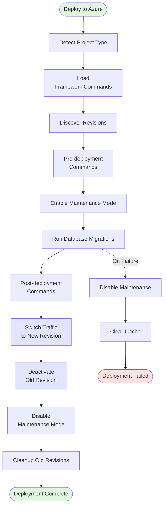

# Deploy to Azure Container App Action

A production-ready GitHub Action for deploying applications to Azure Container Apps using blue-green revision strategy.

## Features

- **Multi-Framework Support**: Shopware, Laravel, Symfony with auto-detection
- **Blue-Green Deployments**: Zero-downtime deployments using Azure revision traffic switching
- **Maintenance Mode**: Framework-specific maintenance mode commands
- **Database Migrations**: Framework-specific migration commands
- **Pre/Post-Deployment Commands**: Configurable command execution
- **Automatic Cleanup**: Keeps last N inactive revisions for rollback
- **Failure Recovery**: Automatic cleanup on deployment failure

## Usage

```yaml
- name: Deploy to Azure Container App
  uses: meteor-digital/github-actions/.github/actions/deploy-to-azure@main
  with:
    app_name: ${{ needs.deploy-infra.outputs.shopwareAppName }}
    resource_group: ${{ needs.deploy-infra.outputs.shopwareAppResourceGroup }}
```

## Inputs

| Input | Description | Required | Default |
|-------|-------------|----------|---------|
| `config_file` | Path to pipeline configuration file | No | `.github/pipeline-config.yml` |
| `app_name` | Azure Container App name | Yes | - |
| `resource_group` | Azure resource group | Yes | - |

## Outputs

| Output | Description |
|--------|-------------|
| `deployment_status` | Status of the deployment (success, failed) |
| `new_revision` | Name of the newly deployed revision |
| `old_revision` | Name of the previously active revision |

## Prerequisites

- **Azure Container App** must be already deployed (via Bicep/Terraform)
- **Multi-revision mode** must be enabled in your Azure Container App configuration
- **Azure CLI** must be authenticated (`azure/login@v2`)
- **Repository** must be checked out (for config file access)

### Multi-Revision Configuration

For blue-green deployments to work, your Azure Container App must be configured with **multiple active revisions**. In your Bicep template:

```bicep
configuration: {
  activeRevisionsMode: 'Multiple'  // Required for blue-green
  ingress: {
    external: true
    targetPort: 8000
    traffic: [
      {
        latestRevision: true  // Initial deployment only
        weight: 100
      }
    ]
  }
}
```

**Important**: 
- ❌ **Single revision mode** (`latestRevision: true` only) will NOT work with this action
- ✅ **Multiple revision mode** allows traffic splitting and blue-green deployments
- The action will manage traffic switching between revisions automatically

## How It Works



## Framework Support

Auto-detects **Shopware**, **Laravel**, or **Symfony** and uses framework-specific commands from `.github/pipeline-config.yml`. No Azure-specific configuration needed.

## Rollback

Reactivate and switch traffic to a previous revision using Azure CLI:
```bash
az containerapp revision activate --name <app> --resource-group <rg> --revision <old-revision>
az containerapp ingress traffic set --name <app> --resource-group <rg> --revision-weight <old-revision>=100
```

## Example

```yaml
- name: Azure Login
  uses: azure/login@v2
  with:
    client-id: ${{ secrets.AZURE_CLIENT_ID }}
    tenant-id: ${{ secrets.AZURE_TENANT_ID }}
    subscription-id: ${{ secrets.AZURE_SUBSCRIPTION_ID }}

- name: Checkout repository
  uses: actions/checkout@v4

- name: Deploy to Azure
  uses: meteor-digital/github-actions/.github/actions/deploy-to-azure@main
  with:
    app_name: ${{ needs.deploy-infra.outputs.shopwareAppName }}
    resource_group: ${{ needs.deploy-infra.outputs.shopwareAppResourceGroup }}
```

## Related Actions

- **`discover-azure-revisions`**: Discovers new and old revisions
- **`run-command-on-azure-container`**: Executes commands on specific revision
- **`switch-azure-traffic`**: Switches traffic between revisions
- **`cleanup-azure-revisions`**: Cleans up old inactive revisions
