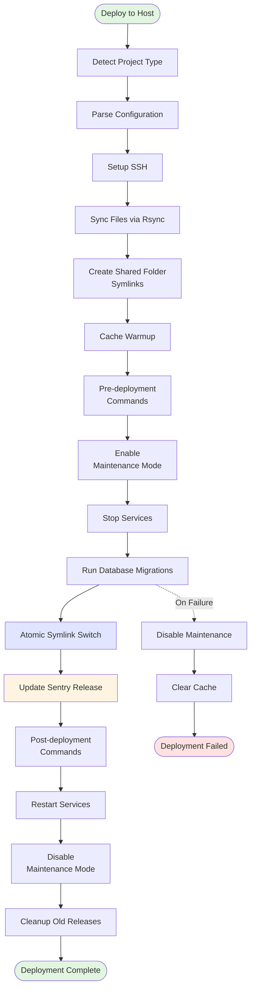

# Deploy to Host Action

A production-ready GitHub Action for deploying applications to remote hosts using proven deployment patterns.

## Features

- **Multi-Framework**: Auto-detects Shopware, Laravel, Symfony with framework-specific defaults
- **Multi-Provider**: Level27, Byte, Hipex, HostedPower, Forge, generic
- **Atomic Deployments**: Zero-downtime via symlink switching
- **Config-Driven**: Two-layer config system (framework defaults + project overrides)
- **Sentry Integration**: Automatic release tracking

## Usage

```yaml
- name: Deploy to environment
  uses: ./actions/deploy-to-host
  with:
    config_file: '.github/pipeline-config.yml'
    environment: 'test'
    build_path: './build'
    ssh_private_key: ${{ secrets.SSH_PRIVATE_KEY }}
    ssh_user: 'deploy'
```

## Inputs

| Input | Description | Required | Default |
|-------|-------------|----------|---------|
| `config_file` | Path to pipeline configuration file | No | `.github/pipeline-config.yml` |
| `environment` | Target environment (test, acc, prod, etc.) | Yes | - |
| `build_path` | Path to built project files | No | `.` |
| `ssh_private_key` | SSH private key for deployment | Yes | - |
| `ssh_user` | SSH username for deployment | Yes | - |

## Outputs

| Output | Description |
|--------|-------------|
| `deployment_status` | Status of the deployment (success, failed) |
| `release_path` | Path to the deployed release |
| `deploy_date` | Deployment date/time identifier |

## Configuration

**Two-layer system**: Framework defaults (auto-loaded) + project overrides (`.github/pipeline-config.yml`)

```yaml
environments:
  test:
    host: "test.example.com"
    path: "/var/www/test"
  prod:
    host: "prod.example.com"
    path: "/var/www/prod"

hosting:
  provider: "level27"  # level27, byte, hipex, hostedpower, forge, generic
  ssh_port: 22
  php_service: "php8.1-fpm"

# Optional: Override framework defaults
# deployment:
#   shared_folders: ["files", "custom/folder"]
#   commands:
#     post_deploy: ["bin/console cache:warmup"]
#   cleanup:
#     keep_releases: 5
```

**Override behavior**: Project config completely replaces framework defaults per section (shared_folders, commands, etc.)


## Deployment Process



## Framework Support

| Framework | Detection | Migration Command | Shared Folders |
|-----------|-----------|-------------------|----------------|
| **Shopware** | `.shopware-project.yml` | `bin/console database:migrate --all` | `files`, `public/media`, `config/jwt`, `var/log` |
| **Laravel** | `artisan` | `php artisan migrate --force` | `storage`, `bootstrap/cache` |
| **Symfony** | `symfony.lock` | `bin/console doctrine:migrations:migrate` | `var`, `public/uploads` |

## Hosting Provider Support

| Provider | PHP Service Restart |
|----------|---------------------|
| **Level27** | `sudo service php8.1-fpm reload` |
| **Byte** | `hypernode-servicectl restart php-fpm` |
| **Hipex** | `hipex restart:phpfpm php-fpm` |
| **HostedPower** | `tscli opcache clear` |
| **Forge** | `sudo service php8.4-fpm reload` |
| **Generic** | `sudo systemctl reload php-service` |

## Failure Recovery

On deployment failure:
1. Disables maintenance mode
2. Clears cache (Shopware/Symfony)
3. Reports failure (does NOT rollback symlink — migrations may have run)

## Related Actions

- **`deploy-to-azure`**: Azure Container Apps equivalent
- **`activate-release`**: Activates release via symlink switching
- **`create-symlinks`**: Creates shared folder symlinks
- **`manage-services`**: Manages PHP-FPM and worker services
- **`cleanup-releases`**: Cleans up old releases
