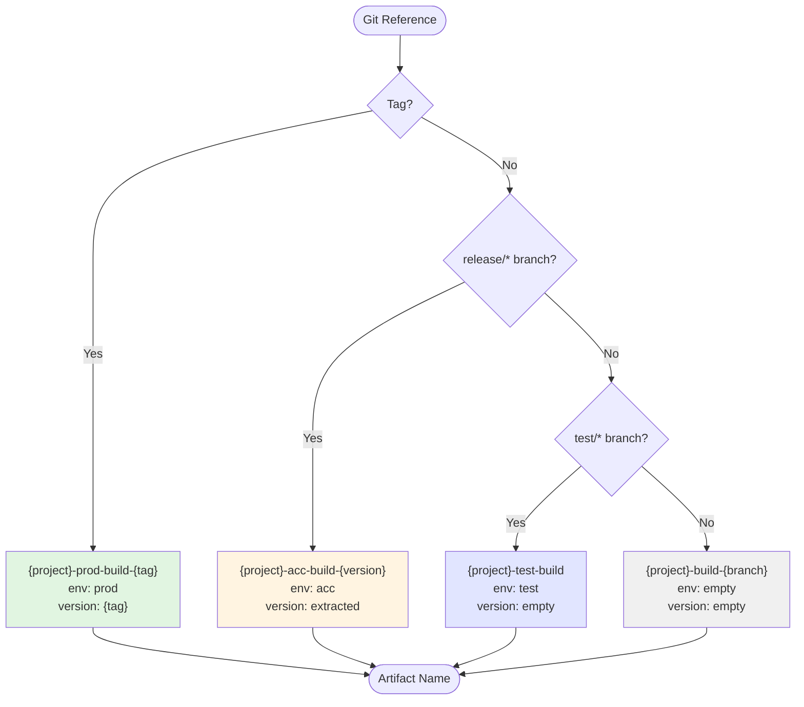

# Determine Artifact Name Action

Determines artifact name and target environment based on Git reference (branch/tag).

## Inputs

| Input | Description | Required | Default |
|-------|-------------|----------|---------|
| `config_file` | Path to pipeline configuration file | No | `.github/pipeline-config.yml` |
| `ref_name` | Git reference name (branch or tag) | Yes | - |
| `ref_type` | Git reference type (`branch` or `tag`) | No | `branch` |

## Outputs

| Output | Description | Example |
|--------|-------------|---------|
| `artifact_name` | Generated artifact name | `my-project-prod-build-1.2.3` |
| `environment` | Target environment | `prod`, `acc`, `test`, or empty |
| `version` | Extracted version number | `1.2.3` or empty |

## Artifact Naming Logic



**Examples:**

| Git Reference | Artifact Name | Environment | Version |
|---------------|---------------|-------------|---------|
| `1.2.3` (tag) | `my-project-prod-build-1.2.3` | `prod` | `1.2.3` |
| `release/1.2.3` | `my-project-acc-build-1.2.3` | `acc` | `1.2.3` |
| `test/feature-x` | `my-project-test-build` | `test` | `` |
| `feature/new-ui` | `my-project-build-feature-new-ui` | `` | `` |

## Usage

```yaml
- name: Determine artifact name
  id: artifact
  uses: meteor-digital/github-actions/.github/actions/determine-artifact-name@main
  with:
    ref_name: ${{ github.ref_name }}
    ref_type: ${{ github.ref_type }}

# Upload artifact
- uses: actions/upload-artifact@v4
  with:
    name: ${{ steps.artifact.outputs.artifact_name }}
    path: build/
```

## Configuration

Project name is read from `.github/pipeline-config.yml`:

```yaml
project:
  name: "my-awesome-project"  # Used in artifact naming
```

## Related Actions

- **`determine-deploy-params`**: Uses artifact names to resolve deployment parameters
- **`parse-pipeline-config`**: Reads project configuration